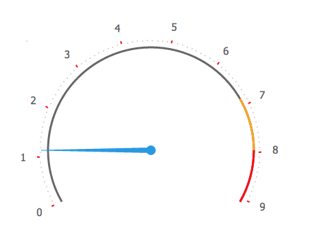

# gauge.js

Простая библиотека для отображения значений на шкале.

Примеры из readme в действии: http://john-lemon.github.io/gauge/

## Установка

#### Bower

    bower install https://github.com/john-lemon/gauge.git

#### npm

    npm install https://github.com/john-lemon/gauge.git

#### Или просто добавить скрипт на страницу

    

## Начало использования

Простое добавление в конец тега <body>

    gauge = new gauge()

Для добавления в DOM-элемент необходимо указать его id

    gauge = new gauge({
      block: 'blockId'
    })

## Параметры

Набор лейблов для отображения и количество промежуточных точек

    gauge = new gauge({
      tags: ['Tag', 'Second Tag', 'Third Tag', 'Last Tag']
      divisionSep: 19
    })

Выбор радиуса шкалы

    gauge = new gauge({
      radius: 100
    })

Отображение шкалы в градусах, а также отображение меток внутри и снаружи

    gauge = new gauge({
      degrees: true   inside: true
    })

#### Значения по умолчанию

    tags: [0,1,2,3,4,5,6,7,8,9],
    radius: 160,
    divisionSep: 9,
    arrowWidth: 8,
    inside: false,
    degrees: false

## Методы

Изменить текущее значение можно следущим образом

    gauge.setValue('type','value')

'type' - тип значения. Варианты: 'string', 'deg'

'string' - если новое значение находится в списке значений tags

'deg' - если вы просто хотите повернуть стрелку на нужный угол

Например:

    gauge.setValue('string','5') // повернет стрелку к значению '5'
    gauge.setValue('deg','60') // повернет стрелку на 60 градусов